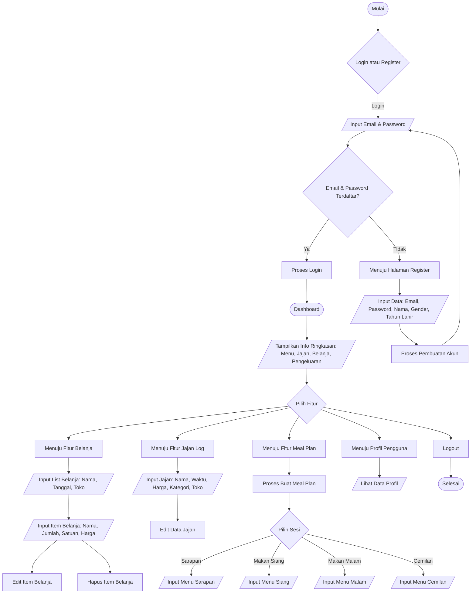

# LSP

```mermaid
flowchart TD
    %% START
    A([Mulai]) --> B{Login atau Register}

    %% LOGIN BRANCH
    B --> |Login| C[/Input Email & Password/]
    C --> D{Email & Password Terdaftar?}
    D --> |Ya| E[Proses Login]
    D --> |Tidak| F[Menuju Halaman Register]

    %% REGISTER BRANCH
    F --> G[/Input Data: Email, Password, Nama, Gender, Tahun Lahir/]
    G --> H[Proses Pembuatan Akun]
    H --> C

    %% DASHBOARD
    E --> I([Dashboard])
    I --> J[/Tampilkan Info Ringkasan: Menu, Jajan, Belanja, Pengeluaran/]
    J --> K{Pilih Fitur}
    
    %% FITUR BELANJA
    K --> L1[Menuju Fitur Belanja]
    L1 --> M1[/Input List Belanja: Nama, Tanggal, Toko/]
    M1 --> M2[/Input Item Belanja: Nama, Jumlah, Satuan, Harga/]
    M2 --> M3[Edit Item Belanja]
    M2 --> M4[Hapus Item Belanja]

    %% FITUR JAJAN LOG
    K --> L2[Menuju Fitur Jajan Log]
    L2 --> N1[/Input Jajan: Nama, Waktu, Harga, Kategori, Toko/]
    N1 --> N2[Edit Data Jajan]

    %% FITUR MEAL PLAN
    K --> L3[Menuju Fitur Meal Plan]
    L3 --> O1[Proses Buat Meal Plan]
    O1 --> O2{Pilih Sesi}
    O2 --> |Sarapan| O3[/Input Menu Sarapan/]
    O2 --> |Makan Siang| O4[/Input Menu Siang/]
    O2 --> |Makan Malam| O5[/Input Menu Malam/]
    O2 --> |Cemilan| O6[/Input Menu Cemilan/]

    %% FITUR PROFIL
    K --> L4[Menuju Profil Pengguna]
    L4 --> P1[/Lihat Data Profil/]

    %% LOGOUT
    K --> L5[Logout]
    L5 --> Q([Selesai])


```
