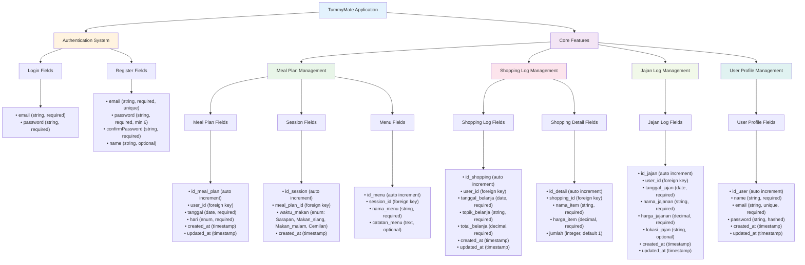
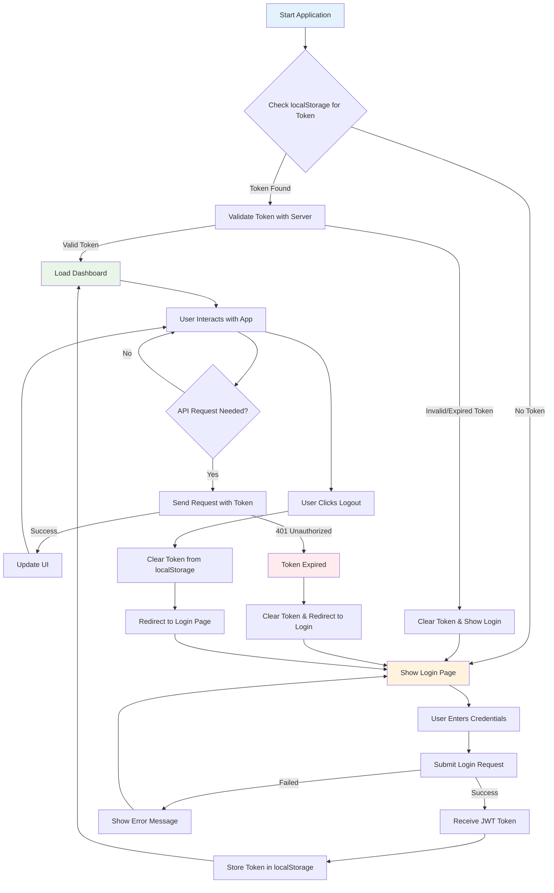

# LSP

```mermaid
flowchart TD
    A[TummyMate Application] --> B[Authentication System]
    A --> C[Core Features]
    
    B --> B1[Login Fields]
    B --> B2[Register Fields]
    
    B1 --> B1a["• email (string, required)<br/>• password (string, required)"]
    B2 --> B2a["• email (string, required, unique)<br/>• password (string, required, min 6)<br/>• confirmPassword (string, required)<br/>• name (string, optional)"]
    
    C --> C1[Meal Plan Management]
    C --> C2[Shopping Log Management]
    C --> C3[Jajan Log Management]
    C --> C4[User Profile Management]
    
    C1 --> C1a[Meal Plan Fields]
    C1a --> C1b["• id_meal_plan (auto increment)<br/>• user_id (foreign key)<br/>• tanggal (date, required)<br/>• hari (enum, required)<br/>• created_at (timestamp)<br/>• updated_at (timestamp)"]
    
    C1 --> C1c[Session Fields]
    C1c --> C1d["• id_session (auto increment)<br/>• meal_plan_id (foreign key)<br/>• waktu_makan (enum: Sarapan, Makan_siang, Makan_malam, Cemilan)<br/>• created_at (timestamp)"]
    
    C1 --> C1e[Menu Fields]
    C1e --> C1f["• id_menu (auto increment)<br/>• session_id (foreign key)<br/>• nama_menu (string, required)<br/>• catatan_menu (text, optional)"]
    
    C2 --> C2a[Shopping Log Fields]
    C2a --> C2b["• id_shopping (auto increment)<br/>• user_id (foreign key)<br/>• tanggal_belanja (date, required)<br/>• topik_belanja (string, required)<br/>• total_belanja (decimal, required)<br/>• created_at (timestamp)<br/>• updated_at (timestamp)"]
    
    C2 --> C2c[Shopping Detail Fields]
    C2c --> C2d["• id_detail (auto increment)<br/>• shopping_id (foreign key)<br/>• nama_item (string, required)<br/>• harga_item (decimal, required)<br/>• jumlah (integer, default 1)"]
    
    C3 --> C3a[Jajan Log Fields]
    C3a --> C3b["• id_jajan (auto increment)<br/>• user_id (foreign key)<br/>• tanggal_jajan (date, required)<br/>• nama_jajanan (string, required)<br/>• harga_jajanan (decimal, required)<br/>• lokasi_jajan (string, optional)<br/>• created_at (timestamp)<br/>• updated_at (timestamp)"]
    
    C4 --> C4a[User Profile Fields]
    C4a --> C4b["• id_user (auto increment)<br/>• name (string, required)<br/>• email (string, unique, required)<br/>• password (string, hashed)<br/>• created_at (timestamp)<br/>• updated_at (timestamp)"]
    
    style A fill:#e3f2fd
    style B fill:#fff3e0
    style C fill:#f3e5f5
    style C1 fill:#e8f5e8
    style C2 fill:#fce4ec
    style C3 fill:#f1f8e9
    style C4 fill:#e0f2f1
```

#fc

```mermaid
flowchart TD
    A[Start Application] --> B{Check localStorage for Token}
    
    B -->|Token Found| C[Validate Token with Server]
    B -->|No Token| D[Show Login Page]
    
    C -->|Valid Token| E[Load Dashboard]
    C -->|Invalid/Expired Token| F[Clear Token & Show Login]
    
    D --> G[User Enters Credentials]
    G --> H[Submit Login Request]
    
    H -->|Success| I[Receive JWT Token]
    H -->|Failed| J[Show Error Message]
    
    I --> K[Store Token in localStorage]
    K --> E
    
    J --> D
    F --> D
    
    E --> L[User Interacts with App]
    L --> M{API Request Needed?}
    
    M -->|Yes| N[Send Request with Token]
    M -->|No| L
    
    N -->|Success| O[Update UI]
    N -->|401 Unauthorized| P[Token Expired]
    
    O --> L
    P --> Q[Clear Token & Redirect to Login]
    Q --> D
    
    L --> R[User Clicks Logout]
    R --> S[Clear Token from localStorage]
    S --> T[Redirect to Login Page]
    T --> D
    
    style A fill:#e3f2fd
    style E fill:#e8f5e8
    style D fill:#fff3e0
    style P fill:#ffebee
```
