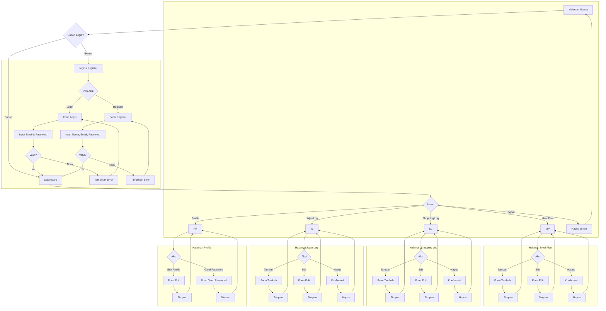
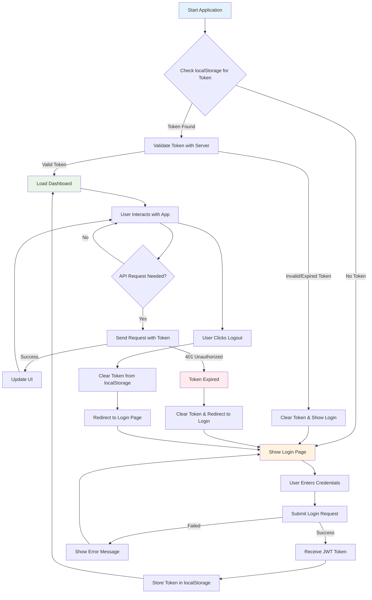

# LSP

```mermaid
flowchart TD
    %% ========= Halaman Utama =========
    A[Halaman&nbsp;Utama] --> B{Sudah&nbsp;Login?}
    B -->|Belum| C[Login&nbsp;/&nbsp;Register]
    B -->|Sudah| D[Dashboard]

    %% ========= Login / Register =========
    subgraph LOGIN_REGISTER [ ]
        direction TB
        C --> C1{Pilih&nbsp;Aksi}
        C1 -->|Login| L1[Form&nbsp;Login]
        L1 --> L2[Input&nbsp;Email&nbsp;&amp;&nbsp;Password]
        L2 --> L3{Valid?}
        L3 -->|Ya| D
        L3 -->|Tidak| L4[Tampilkan&nbsp;Error] --> L1

        C1 -->|Register| R1[Form&nbsp;Register]
        R1 --> R2[Input&nbsp;Nama,&nbsp;Email,&nbsp;Password]
        R2 --> R3{Valid?}
        R3 -->|Ya| D
        R3 -->|Tidak| R4[Tampilkan&nbsp;Error] --> R1
    end

    %% ========= Dashboard =========
    subgraph DASHBOARD [ ]
        direction TB
        D --> E{Menu}
        E -->|Meal&nbsp;Plan| MP
        E -->|Shopping&nbsp;Log| SL
        E -->|Jajan&nbsp;Log| JL
        E -->|Profile| PR
        E -->|Logout| LO[Hapus&nbsp;Token] --> A
    end

    %% ========= Meal Plan =========
    subgraph MEAL_PLAN [Halaman Meal Plan]
        direction TB
        MP --> MP1{Aksi}
        MP1 -->|Tambah| MPT[Form&nbsp;Tambah] --> MPTS[Simpan] --> MP
        MP1 -->|Edit| MPE[Form&nbsp;Edit] --> MPES[Simpan] --> MP
        MP1 -->|Hapus| MPH[Konfirmasi] --> MPHS[Hapus] --> MP
    end

    %% ========= Shopping Log =========
    subgraph SHOPPING_LOG [Halaman Shopping Log]
        direction TB
        SL --> SL1{Aksi}
        SL1 -->|Tambah| SLT[Form&nbsp;Tambah] --> SLTS[Simpan] --> SL
        SL1 -->|Edit| SLE[Form&nbsp;Edit] --> SLES[Simpan] --> SL
        SL1 -->|Hapus| SLH[Konfirmasi] --> SLHS[Hapus] --> SL
    end

    %% ========= Jajan Log =========
    subgraph JAJAN_LOG [Halaman Jajan Log]
        direction TB
        JL --> JL1{Aksi}
        JL1 -->|Tambah| JLT[Form&nbsp;Tambah] --> JLTS[Simpan] --> JL
        JL1 -->|Edit| JLE[Form&nbsp;Edit] --> JLES[Simpan] --> JL
        JL1 -->|Hapus| JLH[Konfirmasi] --> JLHS[Hapus] --> JL
    end

    %% ========= Profile =========
    subgraph PROFILE [Halaman Profile]
        direction TB
        PR --> PR1{Aksi}
        PR1 -->|Edit&nbsp;Profile| PRE[Form&nbsp;Edit] --> PRES[Simpan] --> PR
        PR1 -->|Ganti&nbsp;Password| PRP[Form&nbsp;Ganti&nbsp;Password] --> PRPS[Simpan] --> PR
    end

```

#fc

```mermaid
flowchart TD
    A[Start Application] --> B{Check localStorage for Token}
    
    B -->|Token Found| C[Validate Token with Server]
    B -->|No Token| D[Show Login Page]
    
    C -->|Valid Token| E[Load Dashboard]
    C -->|Invalid/Expired Token| F[Clear Token & Show Login]
    
    D --> G[User Enters Credentials]
    G --> H[Submit Login Request]
    
    H -->|Success| I[Receive JWT Token]
    H -->|Failed| J[Show Error Message]
    
    I --> K[Store Token in localStorage]
    K --> E
    
    J --> D
    F --> D
    
    E --> L[User Interacts with App]
    L --> M{API Request Needed?}
    
    M -->|Yes| N[Send Request with Token]
    M -->|No| L
    
    N -->|Success| O[Update UI]
    N -->|401 Unauthorized| P[Token Expired]
    
    O --> L
    P --> Q[Clear Token & Redirect to Login]
    Q --> D
    
    L --> R[User Clicks Logout]
    R --> S[Clear Token from localStorage]
    S --> T[Redirect to Login Page]
    T --> D
    
    style A fill:#e3f2fd
    style E fill:#e8f5e8
    style D fill:#fff3e0
    style P fill:#ffebee
```
