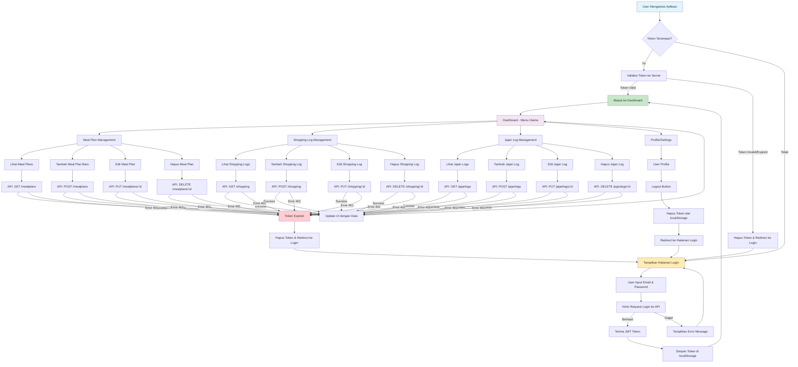
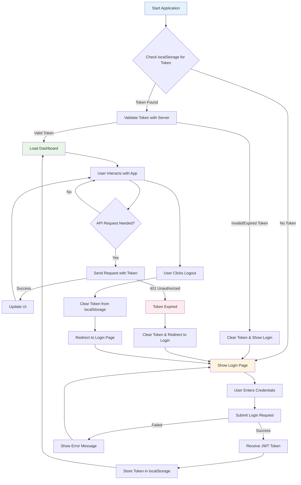

# LSP

```mermaid
flowchart TD
    A[User Mengakses Aplikasi] --> B{Token Tersimpan?}
    
    B -->|Ya| C[Validasi Token ke Server]
    B -->|Tidak| D[Tampilkan Halaman Login]
    
    C -->|Token Valid| E[Masuk ke Dashboard]
    C -->|Token Invalid/Expired| F[Hapus Token & Redirect ke Login]
    
    D --> G[User Input Email & Password]
    G --> H[Kirim Request Login ke API]
    
    H -->|Berhasil| I[Terima JWT Token]
    H -->|Gagal| J[Tampilkan Error Message]
    
    J --> D
    I --> K[Simpan Token di localStorage]
    K --> E
    
    F --> D
    
    E --> L[Dashboard - Menu Utama]
    
    L --> M[Meal Plan Management]
    L --> N[Shopping Log Management]
    L --> O[Jajan Log Management]
    L --> P[Profile/Settings]
    
    M --> M1[Lihat Meal Plans]
    M --> M2[Tambah Meal Plan Baru]
    M --> M3[Edit Meal Plan]
    M --> M4[Hapus Meal Plan]
    
    M1 --> Q[API: GET /mealplans]
    M2 --> R[API: POST /mealplans]
    M3 --> S[API: PUT /mealplans/:id]
    M4 --> T[API: DELETE /mealplans/:id]
    
    N --> N1[Lihat Shopping Logs]
    N --> N2[Tambah Shopping Log]
    N --> N3[Edit Shopping Log]
    N --> N4[Hapus Shopping Log]
    
    N1 --> U[API: GET /shopping]
    N2 --> V[API: POST /shopping]
    N3 --> W[API: PUT /shopping/:id]
    N4 --> X[API: DELETE /shopping/:id]
    
    O --> O1[Lihat Jajan Logs]
    O --> O2[Tambah Jajan Log]
    O --> O3[Edit Jajan Log]
    O --> O4[Hapus Jajan Log]
    
    O1 --> Y[API: GET /jajanlogs]
    O2 --> Z[API: POST /jajanlogs]
    O3 --> AA[API: PUT /jajanlogs/:id]
    O4 --> BB[API: DELETE /jajanlogs/:id]
    
    Q -->|Success| CC[Update UI dengan Data]
    R -->|Success| CC
    S -->|Success| CC
    T -->|Success| CC
    U -->|Success| CC
    V -->|Success| CC
    W -->|Success| CC
    X -->|Success| CC
    Y -->|Success| CC
    Z -->|Success| CC
    AA -->|Success| CC
    BB -->|Success| CC
    
    Q -->|Error 401| DD[Token Expired]
    R -->|Error 401| DD
    S -->|Error 401| DD
    T -->|Error 401| DD
    U -->|Error 401| DD
    V -->|Error 401| DD
    W -->|Error 401| DD
    X -->|Error 401| DD
    Y -->|Error 401| DD
    Z -->|Error 401| DD
    AA -->|Error 401| DD
    BB -->|Error 401| DD
    
    DD --> EE[Hapus Token & Redirect ke Login]
    EE --> D
    
    CC --> L
    
    P --> FF[User Profile]
    FF --> GG[Logout Button]
    
    GG --> HH[Hapus Token dari localStorage]
    HH --> II[Redirect ke Halaman Login]
    II --> D
    
    style A fill:#e1f5fe
    style E fill:#c8e6c9
    style D fill:#ffecb3
    style DD fill:#ffcdd2
    style L fill:#f3e5f5
```

#fc

```mermaid
flowchart TD
    A[Start Application] --> B{Check localStorage for Token}
    
    B -->|Token Found| C[Validate Token with Server]
    B -->|No Token| D[Show Login Page]
    
    C -->|Valid Token| E[Load Dashboard]
    C -->|Invalid/Expired Token| F[Clear Token & Show Login]
    
    D --> G[User Enters Credentials]
    G --> H[Submit Login Request]
    
    H -->|Success| I[Receive JWT Token]
    H -->|Failed| J[Show Error Message]
    
    I --> K[Store Token in localStorage]
    K --> E
    
    J --> D
    F --> D
    
    E --> L[User Interacts with App]
    L --> M{API Request Needed?}
    
    M -->|Yes| N[Send Request with Token]
    M -->|No| L
    
    N -->|Success| O[Update UI]
    N -->|401 Unauthorized| P[Token Expired]
    
    O --> L
    P --> Q[Clear Token & Redirect to Login]
    Q --> D
    
    L --> R[User Clicks Logout]
    R --> S[Clear Token from localStorage]
    S --> T[Redirect to Login Page]
    T --> D
    
    style A fill:#e3f2fd
    style E fill:#e8f5e8
    style D fill:#fff3e0
    style P fill:#ffebee
```
