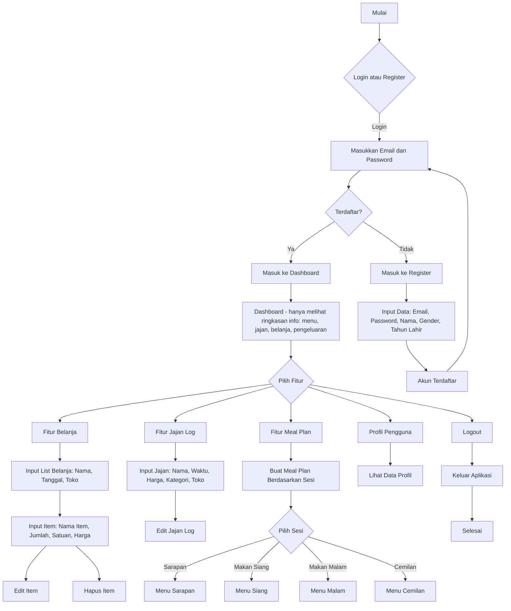

# LSP

```mermaid
flowchart TD
    A[Mulai] --> B{Login atau Register}
    
    B --> |Login| C[Masukkan Email dan Password]
    C --> D{Terdaftar?}
    D --> |Ya| E[Masuk ke Dashboard]
    D --> |Tidak| F[Masuk ke Register]

    F --> G[Input Data: Email, Password, Nama, Gender, Tahun Lahir]
    G --> H[Akun Terdaftar]
    H --> C

    %% DASHBOARD
    E --> I[Dashboard - hanya melihat ringkasan info: menu, jajan, belanja, pengeluaran]

    I --> K{Pilih Fitur}
    K --> L1[Fitur Belanja]
    K --> L2[Fitur Jajan Log]
    K --> L3[Fitur Meal Plan]
    K --> L4[Profil Pengguna]
    K --> L5[Logout]

    %% FITUR BELANJA
    L1 --> M1[Input List Belanja: Nama, Tanggal, Toko]
    M1 --> M2[Input Item: Nama Item, Jumlah, Satuan, Harga]
    M2 --> M3[Edit Item]
    M2 --> M4[Hapus Item]

    %% FITUR JAJAN LOG
    L2 --> N1[Input Jajan: Nama, Waktu, Harga, Kategori, Toko]
    N1 --> N2[Edit Jajan Log]

    %% FITUR MEAL PLAN
    L3 --> O1[Buat Meal Plan Berdasarkan Sesi]
    O1 --> O2{Pilih Sesi}
    O2 --> |Sarapan| O3[Menu Sarapan]
    O2 --> |Makan Siang| O4[Menu Siang]
    O2 --> |Makan Malam| O5[Menu Malam]
    O2 --> |Cemilan| O6[Menu Cemilan]

    %% PROFILE
    L4 --> P1[Lihat Data Profil]

    %% LOGOUT
    L5 --> Q[Keluar Aplikasi]
    Q --> R[Selesai]


```
