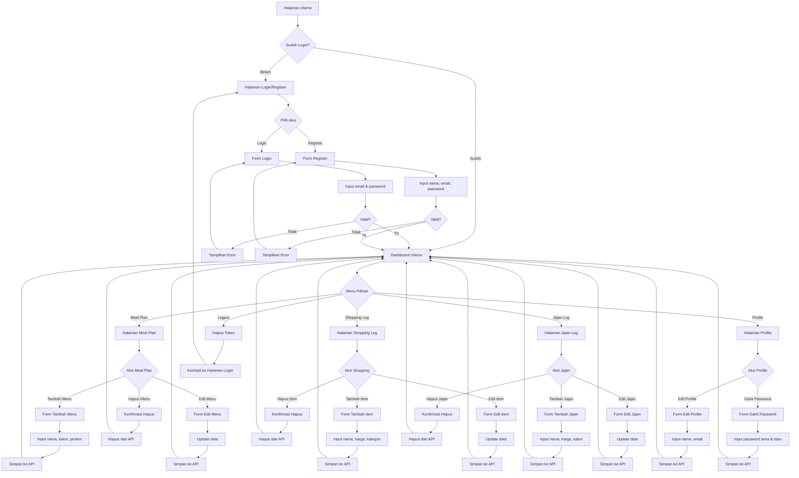
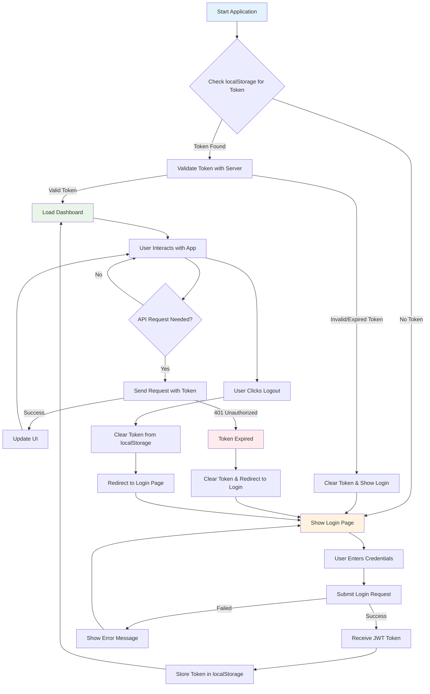

# LSP

```mermaid
flowchart TD
    A[Halaman Utama] --> B{Sudah Login?}
    
    B -->|Belum| C[Halaman Login/Register]
    B -->|Sudah| D[Dashboard Utama]
    
    %% === Alur Login/Register ===
    C --> C1{Pilih Aksi}
    C1 -->|Login| C2[Form Login] 
    C2 --> C3[Input email & password] 
    C3 --> C4{Valid?}
    C1 -->|Register| C5[Form Register] 
    C5 --> C6[Input nama, email, password] 
    C6 --> C7{Valid?}
    
    C4 -->|Ya| D
    C4 -->|Tidak| C8[Tampilkan Error] 
    C8 --> C2
    C7 -->|Ya| D
    C7 -->|Tidak| C9[Tampilkan Error] 
    C9 --> C5
    
    %% === Dashboard Utama ===
    D --> E{Menu Pilihan}
    
    %% === Meal Plan ===
    E -->|Meal Plan| F[Halaman Meal Plan]
    F --> F1{Aksi Meal Plan}
    F1 -->|Tambah Menu| F2[Form Tambah Menu] 
    F2 --> F3[Input nama, kalori, protein] 
    F3 --> F4[Simpan ke API]
    F1 -->|Edit Menu| F5[Form Edit Menu] 
    F5 --> F6[Update data] 
    F6 --> F7[Simpan ke API]
    F1 -->|Hapus Menu| F8[Konfirmasi Hapus] 
    F8 --> F9[Hapus dari API]
    
    %% === Shopping Log ===
    E -->|Shopping Log| G[Halaman Shopping Log]
    G --> G1{Aksi Shopping}
    G1 -->|Tambah Item| G2[Form Tambah Item] 
    G2 --> G3[Input nama, harga, kategori] 
    G3 --> G4[Simpan ke API]
    G1 -->|Edit Item| G5[Form Edit Item] 
    G5 --> G6[Update data] 
    G6 --> G7[Simpan ke API]
    G1 -->|Hapus Item| G8[Konfirmasi Hapus] 
    G8 --> G9[Hapus dari API]
    
    %% === Jajan Log ===
    E -->|Jajan Log| H[Halaman Jajan Log]
    H --> H1{Aksi Jajan}
    H1 -->|Tambah Jajan| H2[Form Tambah Jajan] 
    H2 --> H3[Input nama, harga, kalori] 
    H3 --> H4[Simpan ke API]
    H1 -->|Edit Jajan| H5[Form Edit Jajan] 
    H5 --> H6[Update data] 
    H6 --> H7[Simpan ke API]
    H1 -->|Hapus Jajan| H8[Konfirmasi Hapus] 
    H8 --> H9[Hapus dari API]
    
    %% === Profile ===
    E -->|Profile| I[Halaman Profile]
    I --> I1{Aksi Profile}
    I1 -->|Edit Profile| I2[Form Edit Profile] 
    I2 --> I3[Input nama, email] 
    I3 --> I4[Simpan ke API]
    I1 -->|Ganti Password| I5[Form Ganti Password] 
    I5 --> I6[Input password lama & baru] 
    I6 --> I7[Simpan ke API]
    
    %% === Logout ===
    E -->|Logout| J[Hapus Token] 
    J --> K[Kembali ke Halaman Login]
    
    %% === Kembali ke Dashboard ===
    F4 --> D
    F7 --> D
    F9 --> D
    G4 --> D
    G7 --> D
    G9 --> D
    H4 --> D
    H7 --> D
    H9 --> D
    I4 --> D
    I7 --> D
    K --> C
```

#fc

```mermaid
flowchart TD
    A[Start Application] --> B{Check localStorage for Token}
    
    B -->|Token Found| C[Validate Token with Server]
    B -->|No Token| D[Show Login Page]
    
    C -->|Valid Token| E[Load Dashboard]
    C -->|Invalid/Expired Token| F[Clear Token & Show Login]
    
    D --> G[User Enters Credentials]
    G --> H[Submit Login Request]
    
    H -->|Success| I[Receive JWT Token]
    H -->|Failed| J[Show Error Message]
    
    I --> K[Store Token in localStorage]
    K --> E
    
    J --> D
    F --> D
    
    E --> L[User Interacts with App]
    L --> M{API Request Needed?}
    
    M -->|Yes| N[Send Request with Token]
    M -->|No| L
    
    N -->|Success| O[Update UI]
    N -->|401 Unauthorized| P[Token Expired]
    
    O --> L
    P --> Q[Clear Token & Redirect to Login]
    Q --> D
    
    L --> R[User Clicks Logout]
    R --> S[Clear Token from localStorage]
    S --> T[Redirect to Login Page]
    T --> D
    
    style A fill:#e3f2fd
    style E fill:#e8f5e8
    style D fill:#fff3e0
    style P fill:#ffebee
```
